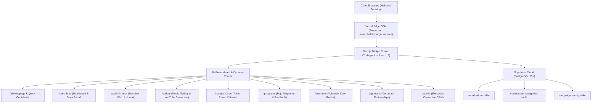

# 2. System Architecture & Technical Design
## PBEL City Durgotsav 2026 Web Platform

### 1. Architectural Overview

The **PBEL City Durgotsav Platform** is built on a high-speed, serverless, JAMStack edge architecture:

---

### 2. Complete Route Inventory (18 Routes)

| Route | Rendering | Purpose |
| :--- | :--- | :--- |
| `/` | Static / Edge | Homepage, Hero, Quick Seva, Headliner Timeline, Tower Progress, Sponsor Ribbon |
| `/contribute` | Static / Client | Dual-Mode Open & Curated Seva Storefront, QR Checkout, Devotional Share Modal |
| `/wall-of-honor` | Static / Client | Devotee Wall of Honor, Tower & Date Filters, Resident Search, Memento Cards |
| `/gallery` | Static / Client | Photo Gallery, Video Showcase CMS, YouTube Embeds, Official Social Links |
| `/receipt` | Dynamic / Client | Strict direct-token receipt viewer (`?id=...`) with Privacy Protection notice |
| `/programs` | Static / Client | 6-Day Pujo Nirghanto, Pratibimb Stage Line-up, Performer Slot Applications |
| `/volunteer` | Static / Client | 4-Domain Volunteer Registration, Shift Picker, Roster Submissions |
| `/sponsors` | Static / Client | Corporate Sponsorship Deck, Tier Packages, Partner Inquiries |
| `/anandamela` | Static / Client | Anandamela Food Stalls, Menu Listings, Stall Registration |
| `/committee` | Static / Client | 7-Wing Executive Committee Directory & Organization Chart |
| `/guide` | Static / Client | Township Visitor Guide, Venue Navigation, Pujo Etiquette |
| `/bhog-pass` | Static / Client | Digital Bhog Token Verification |
| `/admin` | Static / Client | Executive Committee CRM, Typo Editor, Wall Visibility, YouTube CMS |
| `/_not-found` | Static | Festive 404 Error Page |

---

### 3. Data Flow & Security Model

1. **Zero-Fee UPI Flow**:
   - Devotee initiates contribution &rarr; Dynamic UPI URI constructed targeting `pbelsanskritiksamiti@icici`.
   - Payment verified by devotee with 12-digit UTR/Ref &rarr; Recorded as `Pending Verification`.
   - Admin reconciles against ICICI Bank statement &rarr; 1-click Approve moves status to `Success`.
2. **Privacy Protection**:
   - Devotee cards on `/wall-of-honor` display Devotee Name (or "Devout Well Wisher"), Flat Number, and exact Seva Category.
   - Individual contribution amounts are completely excluded from public cards.
   - Public directory search on `/receipt` is removed; direct tokens allow donors to view their own receipt securely.
   - Keepsake Memento Cards display spiritual tribute and seva offering with **zero monetary figures**.
