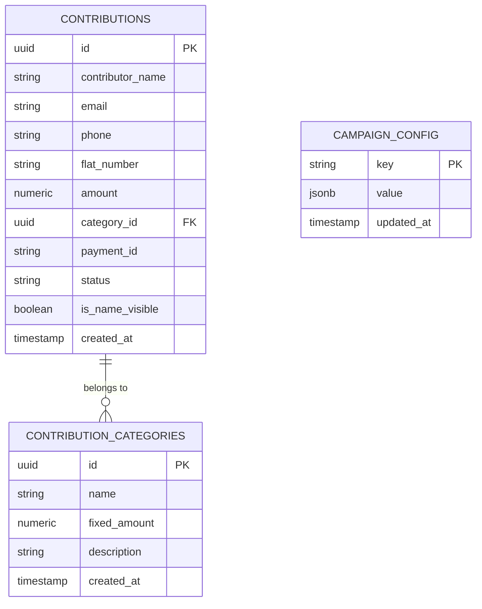

# 4. Database Schema & Entity Relationship Diagram (ERD)
## PBEL City Durgotsav 2026 Web Platform

### 1. PostgreSQL Schema Definition

---

### 2. Key Table Dictionary

#### `contributions`
- `id` (UUID): Unique primary key.
- `contributor_name` (TEXT): Devotee or family name.
- `flat_number` (TEXT): PBEL City tower and flat designation (e.g., `Tower D - 1106`).
- `amount` (NUMERIC): Contribution amount in INR.
- `category_id` (UUID): Foreign key reference to `contribution_categories(id)`.
- `payment_id` (TEXT): Bank UTR reference or system payment ID (e.g. `UTR_129036739285`).
- `status` (TEXT): `Pending Verification`, `Success`, or `Failed`.
- `is_name_visible` (BOOLEAN): `true` for public display, `false` for "Devout Well Wisher".
- `created_at` (TIMESTAMPTZ): Timestamp of contribution submission.

#### `contribution_categories`
- `id` (UUID): Unique category identifier.
- `name` (TEXT): Official Seva package title (e.g., `Maha Ashtami Flowers`, `Maha Ashtami Morning Puja`, `Maha Ashtami Bhog`).
- `fixed_amount` (NUMERIC): Default offering price in INR.
- `description` (TEXT): Metadata tags for status, limit, and features.

#### `campaign_config`
- `key` (TEXT): Configuration key (`branding_config`, `gallery_config`, `committee_wings`, `highlight_popup_config`, `pss_members`).
- `value` (JSONB): Dynamic configuration payload.
